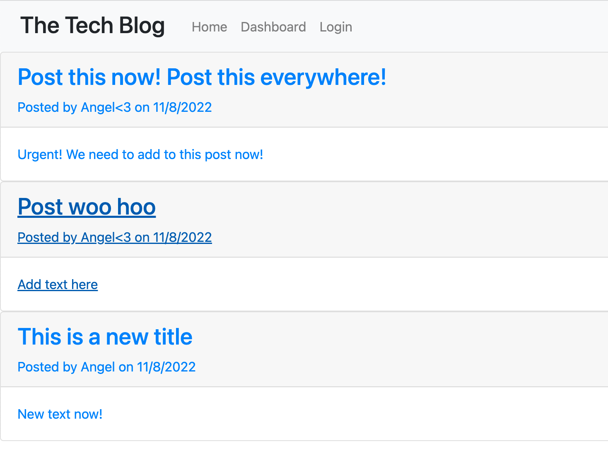
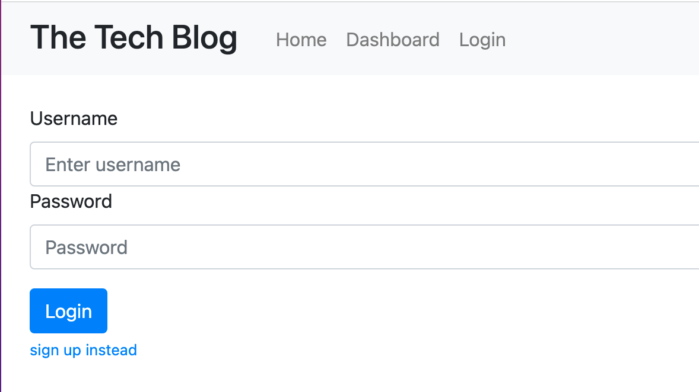
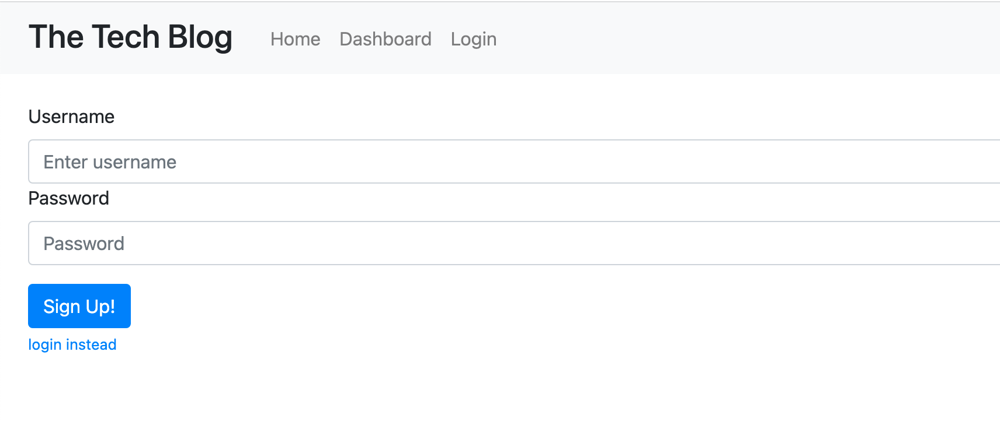
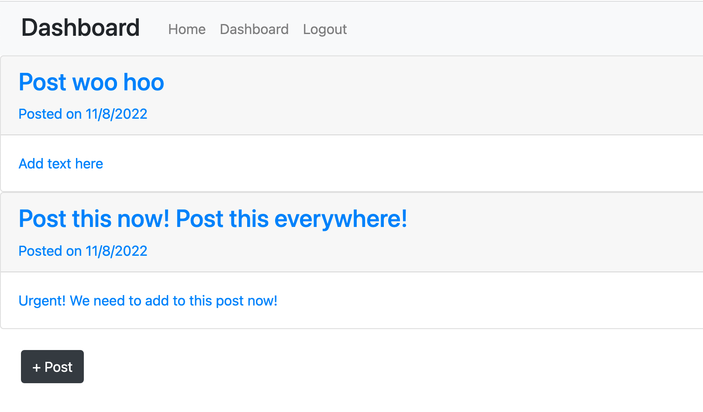
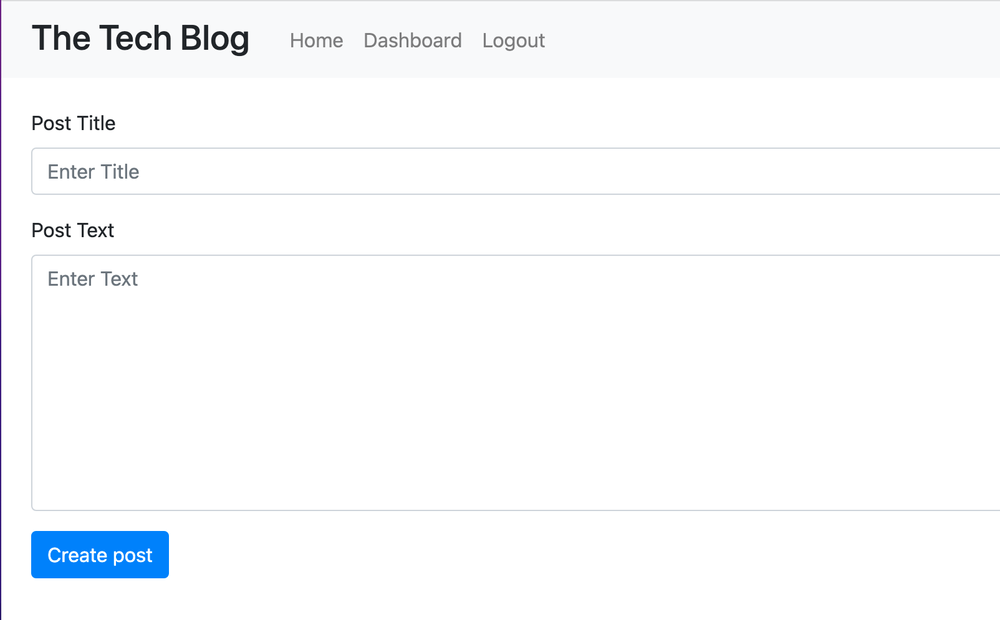
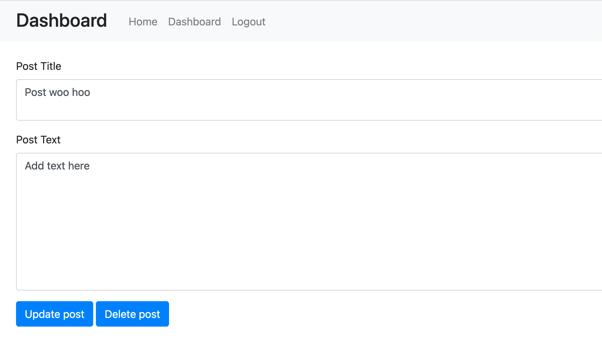
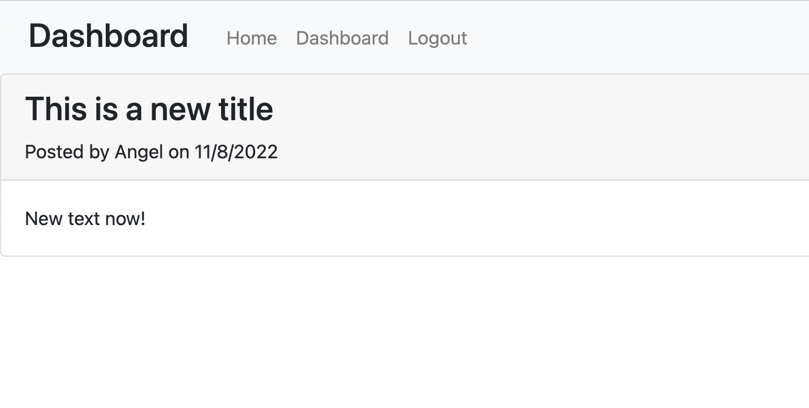

# Tech Blog

## Description

When learning how to use technology, it is important and necessary to write about what you have learned. This website can help with this step of the learning process. Once a user creates an account, they can post and comment on any tech blog post no matter what their skill level is.

This project helped teach me how to build a full-stack application from scratch. Most importantly, I learned to apply what I newly learned about sessions and cookies to make the website more secure.

## Table of Contents

- [Installation](#installation)
- [Usage](#usage)
- [Credits](#credits)
- [License](#license)
- [Badges](#badges)

## Installation

1. Click on green code button and copy the ssh link
2. Open up terminal or git bash, then navigate to where you want the repository to be placed.
3. Type out "git clone (ssh link)"
4. Be sure to install Node.js. Node.js is necessary to run this program. If you need to, download it from the [Node.js website](https://nodejs.org/en/download/).
5. Once you have installed Node.js, navigate to inside the 'ecommerce-back-end' folder
6. Run 'npm install' or 'npm i' to install packages within package.json
7. Install MySQL on your local computer's terminal. You can download a compatible version on [MySQL's dowload website](https://dev.mysql.com/downloads/mysql/).

## Usage

To start this program locally on your own computer, navigate to your 'tech-blog' folder and run 'npm start'. Once the server has started, go to 'http://localhost:3001' in the browser of your choosing. You can also use [my website](https://post-on-tech-blog.herokuapp.com).

You will be greeted by the homepage with a list of blog posts.

To do anything else besides this, you will need to log in or sign up. (All functional routes besides the homepage will redirect to the login page when user is logged out).

To login, click on the login button in the navigation bar. This will redirect you to the login page. 

If you want to sign up instead, click on the link under the login button. This will direct you to the signup page

On either the signup and login, fill out your username and password, then press the button. If successful, you will be redirect you to the dashboard.

To create a new post, click on the "+ Post" button.

This will bring you to a form where you can write a post, then press the button to create it. You will then be redirected back to the dashboard.

To update or delete a post, click on the post. 

This will bring you to a form where you can edit a post, then press the button update it or delete it. You will then be redirected back to the dashboard.

To view a post from the homepage, click on it. This will bring you to a page where you can view the posts and its associated comments. 

To logout, press the logout button in the navbar.

## Credits

Bootstrap: https://getbootstrap.com/docs/4.3/getting-started/introduction/ 

Session secret: https://stackoverflow.com/questions/18565512/importance-of-session-secret-key-in-express-web-framework 

## Badges

